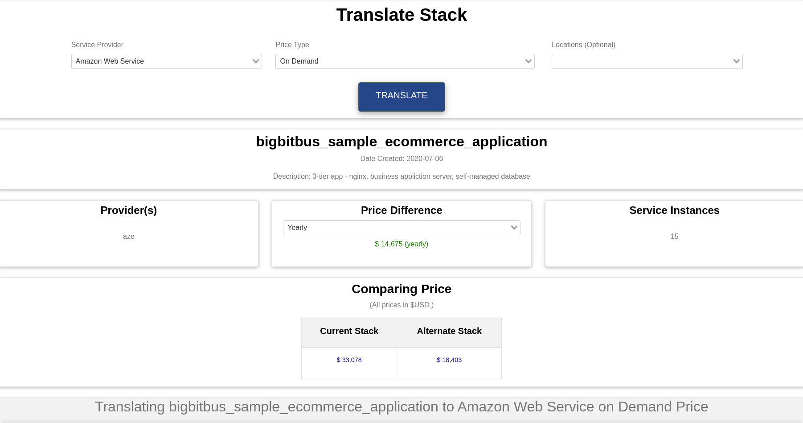
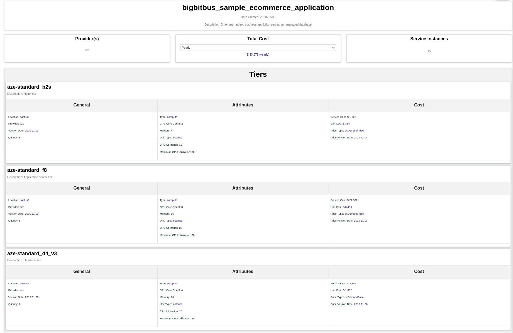
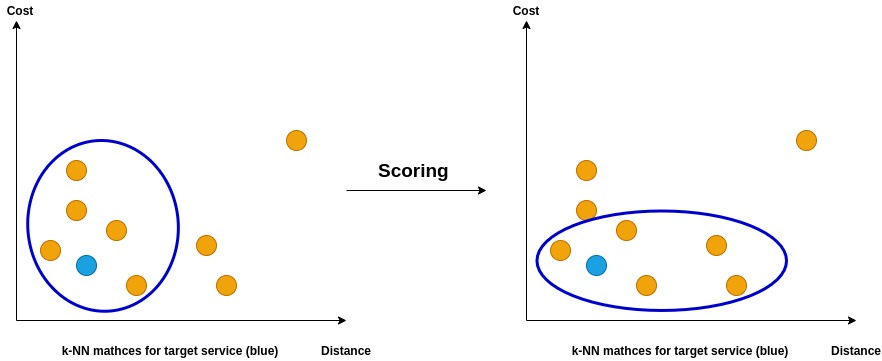

## Aim 

The global public cloud service market is a multi-billion dollar industry, which continues to grow at a rapid pace as businesses continue to invest in these technologies. Given that these cloud services become the primary drivers of an organization’s IT infrastructure - the decision to choose a cloud service provider becomes a complex one. Add to this a lack of transparent and unbiased data sources on cloud service performance and pricing a wrong decision can have a lasting negative impact. This is the void we aim to fill at BigBitBus Inc. and help businesses manage the technology risk  

The main idea behind developing a matching service is to create a service that allows users to compare cloud infrastructure costs and features across the many providers in the market today. A lack of transparency in this area makes it difficult for decision makers to pick the right service and pricing for their organisational needs.

A cursory search for any price comparison on Google mostly yields ad-hoc articles doing small comparisons across a handful of services. The other extreme are online tools, which mostly reproduce data from pricing tables on provider websites. This usually has no relation to a user’s infrastructure and is typically just a big list of prices.

This is the space our product aims to fill. We provide a way for users to replicate their infrastructure in our application in form of application stacks, which are composed of individual cloud services. For example, consider a simple e-commerce application. The application consists of 3 tiers: an application tier, a database tier, and an NGINX tier. The infrastructure runs on Microsoft’s Azure platform and costs about $33,000 a year. The details of the application stack can be found in the figure below:

 The stack feature allows our users to directly translate their infrastructure to an alternate provider. This translation provides an estimate of infrastructure costs on the alternate provider. It also provides multiple options for a single service, which enables users to clearly understand tradeoffs between different providers. Continuing with our e-commerce application above we use the BigBitBus console to translate the application stack to a different provider say Amazon Web Services (AWS). According to our matching algorithm the same e-commerce application  can be run on AWS for  approximately $14,000 , which is  less than half  the price of Azure with the same virtual machines and data centre location.

## Data

Data

Our dataset is made up of various cloud infrastructure services from major providers like AWS, Google, Azure, Alibaba etc. The data contain information about the pricing of these services and certain defining attributes of each service type. For example for a compute service one might like to compare on the basis of virtual machine size as given by the number of CPU cores and the memory. The data set also includes region data on the service, which adds an additional dimension as the prices and availability vary across regions.

Data Preparation
The data is stored in a Postgres database divided into various tables. This structure while useful for storing and retrieving data efficiently does not lend itself to for direct use in a machine learning based algorithm. The first step was to create a clean dataset that could be used by a machine learning algorithm to produce meaningful results.

To create this dataset we use a simple Python script to retrieve the data from our database and put it in a large table containing all services across providers and regions. Even though it is a simple process it is the volume of the data that make it a time consuming and intensive task. Keeping the I/O operations to a minimum proved to be the right solution in reducing the rime requirements. The initial version of our script required 12-15 seconds to go over our database, but with the reduced I/O approach the time was reduced to 1-2 seconds. Infact, the change enabled us to incorporate the method for usage ‘on the fly’, which allowed us to create valuable features like private/on-site provider matching for our users.

The raw data was then enhanced with new features as well as adjusted to ensure that the training results were not biased due to data. These measures include scaling the features so that large features like memory do not dominate as well as encoding categorical variables as numbers. The entire data pipeline is illustrated in the figure below.

## Data Prepration
Data Preparation
The data is stored in a Postgres database divided into various tables. This structure while useful for storing and retrieving data efficiently does not lend itself to for direct use in a machine learning based algorithm. The first step was to create a clean dataset that could be used by a machine learning algorithm to produce meaningful results.

To create this dataset we use a simple Python script to retrieve the data from our database and put it in a large table containing all services across providers and regions. Even though it is a simple process it is the volume of the data that make it a time consuming and intensive task. Keeping the I/O operations to a minimum proved to be the right solution in reducing the rime requirements. The initial version of our script required 12-15 seconds to go over our database, but with the reduced I/O approach the time was reduced to 1-2 seconds. Infact, the change enabled us to incorporate the method for usage ‘on the fly’, which allowed us to create valuable features like private/on-site provider matching for our users.

The raw data was then enhanced with new features as well as adjusted to ensure that the training results were not biased due to data. These measures include scaling the features so that large features like memory do not dominate as well as encoding categorical variables as numbers. The entire data pipeline is illustrated in the figure below.

To further enhance the data we run a clustering algorithm to club similar services. This is helpful as within a service type there are machines that are optimized for certain uses e.g. CPU Optimized machines have a higher core count relative to memory. Ultimately it  improves the quality of matches returned by the algorithm.  

## The Matching Algorithm
The existing approach to finding matches for services used a rules based system that would scan the entire database for matching services then compute a score and rank the matches based on the computed score. This was a slow process and could run in excess of 4-5 seconds for some services. Such long waits are detrimental to the user experience. Further these matches did not always return the most relevant matches.

With widespread accessibility of machine learning algorithms through popular libraries like Python’s <a href="https://scikit-learn.org/">sklearn</a>, using an ML approach was a natural choice. The matching algorithm is a simple <a href="https://en.wikipedia.org/wiki/K-nearest_neighbors_algorithm"> k-Nearest Neighbours (k-NN)</a> algorithm that finds closely related cloud services on a different provider using the relevant attributes for the kind of service being matched. This is an unconventional use of the k-NN algorithm, which is usually used in the context of regression and classification problems.

The idea is straightforward- compute <a href="https://en.wikipedia.org/wiki/Euclidean_distance">euclidean distances </a> between various services and pick the closest ones. Though this ML engine is at the centre of our matching algorithm the process does not end there. The k-NN algorithm is augmented with filtering and scoring to zero in on best possible matches in the least amount of time.

## The Scoring Method

As stated above the matching algorithm does not naively return the closest service by distance as calculated using the k-NN algorithm. The algorithm uses a simple scoring system that balances between the quality(closeness) of the match and its cost. The score uses an input parameter alpha that ranges from 0 to 1. This can be adjusted to choose for closeness or cost of the match. The process by which the scoring formula rebalances matches is shown in the figure below. The matched services are plotted on the basis of the k-NN distance and the cost and the blue ellipses indicate the returned matches.

## Future Development

There are many possible extensions of the algorithm. The first natural step is to abstract the algorithm to accommodate for more service types like networking, storage, CDNs, databases etc. This has been implemented to a large extent as we introduce newer services to our database.

As the product scales it will become necessary to adapt the data pipeline for machine learning. To this end popular big data tools may be used, which are designed to handle a much larger volume of data. The integration of these tools has a learning curve and is not required in the near future. Another small feature in matching is giving the user the ability to choose between the quality and cost of the matches. The user can change the parameter - alpha and supply it as an input parameter to the API request.

Infact, the usual approach to a matching problem is using a recommendation engine, but a lack of user feedback makes it difficult to implement such a solution. The idea is after a critical mass of users on our platform we can ask the users for suggestions regarding the most popular services. We can use these suggestions to build matches that work better in the real world.

## Conclusion

This simple matching algorithm is used to create insight into an area, which is not as transparent. But this is not the only service we offer. Our product allows users to compare individual services against each other across various attributes, regions and pricing regimes.
These are the clearest comparisons of cloud services. available to technical decision makers. We invite you to use our free tool the <a hreg="https://b3console.bigbitbus.com/"> B3Console </a> to gain insights about your cloud infrastructure.

## References
James, G., Witten, D., Hastie, T., & Tibshirani, R. (2017). An introduction to statistical learning: With applications in R. New York: Springer.

Learn. (n.d.). Retrieved February 08, 2021, from https://scikit-learn.org/stable/index.html

